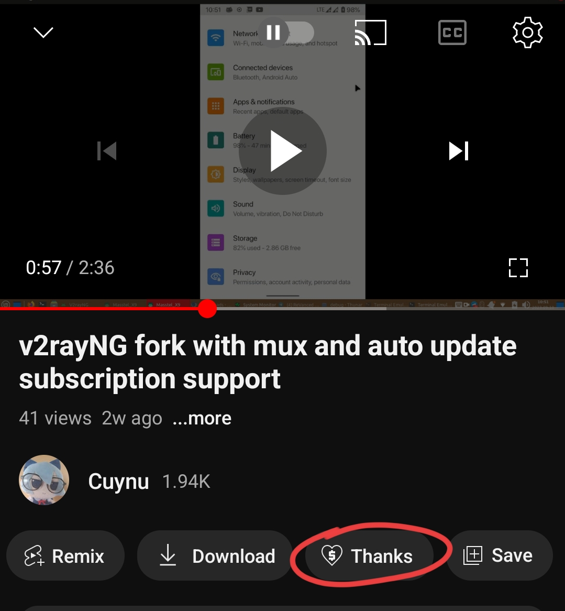

# YouTube Vanced+ [WIP]
Another YouTube Vanced Unofficial project named YouTube Vanced+ [WIP] maintained by [Cuynu](https://gitlab.com/cuynu)

## Mirrored from GitHub !

## Table of Contents (Quick navigation) 

* [Credits](#credits)
* [Features](#features)
* [Known issues](#known-issues)
* [Building YouTube Vanced+ from source](#building)
* [Download YouTube Vanced+](#download)
* [Download YouTube Vanced RVX archived release](#download-archived-release-rvx)
* [Troubleshoot](#troubleshoot)
* [Source code](#source-code)

# Introduction 
This project was created after discontinuation of Vanced official aswell wars between Unofficial Vanced and ReVanced Extended. Its not `YouTube Vanced` and just is the CLONE of `YouTube Vanced`. The project are in development and will going release soon as possible!

# Features 
- Same as Official `YouTube Vanced`
- YouTube Vanced+ blocks ads from YouTube and uses SponsorBlock to skip in-video sponsor segments
- The picture-in-picture mode allows watching videos in a floating window
- Background play allows playing video sound in background
- Forced VP9 codec
- Override max resolution
- Swipe control for brightness and volume
- Google login like the original YouTube app using MicroG
- Dislike counter re-added using the Return YouTube Dislike database
- Disable YouTube Shorts function
- Enable old layout of YouTube
- Download videos from YouTube using external downloader app
- Custom video speed
- Enable YouTube Premium header (not actually enable Premium features!)
- Many more...

# Community/Updates channel
Join YouTube Vanced+ Community/Updates channel to receive patches & release & news updates and discuss with other people on us community! 

  

  

# Download  

### YouTube Vanced+ non-root variant 

**[Download latest version of Vanced MicroG](https://github.com/cuynu/VancedMicroG/releases/latest/download/microg.apk)**

Not yet right now! wait for we implement, check for implement status in community above~~

### YouTube Vanced+ root variant (Magisk/KSU) 
Not yet right now! wait for we implement, check for implement status in community above~~

### Download archived release (RVX)

**Warning : This is old YouTube Vanced build based on ReVanced Extended patches which is deprecated, aswell my worst because it just is ReVanced Extended build with YouTube Vanced branding logo & name. DO NOT REPORT ISSUE WHEN USE THIS BUILD!**

**[YouTube Vanced 18.21.34 (LAST) (RVX) (ARCHIVED)](https://github.com/cuynu/archive/releases/tag/18.21.34)**

**[YouTube Music Vanced 5.39.52 (RVX) (ARCHIVED)](https://github.com/cuynu/archive/releases/tag/5.39.52)**

**[YouTube Vanced 18.02.33 (RVX) (ARCHIVED)](https://github.com/cuynu/archive/releases/tag/18.02.33)**

**[YouTube Vanced 18.01.38 (RVX) (ARCHIVED)](https://github.com/cuynu/archive/releases/tag/18.01.38)**

**[YouTube Vanced 17.45.36 (RVX) (ARCHIVED)](https://github.com/cuynu/archive/releases/tag/17.45.36)**

**[YouTube Vanced 17.45.36 (RVX) (ARCHIVED)](https://github.com/cuynu/archive/releases/tag/17.45.34)**

**[YouTube Vanced 17.43.36 (RVX) (ARCHIVED)](https://github.com/cuynu/archive/releases/tag/17.43.36)**

**[YouTube Vanced 17.41.34 (RVX) (ARCHIVED)](https://github.com/cuynu/archive/releases/tag/17.41.34)**

**[YouTube Vanced 17.39.35 (Android 6 & 7) (RVX) (ARCHIVED)](https://github.com/cuynu/archive/releases/tag/17.39.35)**

## Source code

**Official YouTube app itself are proprietary and closed source, we can't access YouTube source code because its are private which only Google/YouTube developer can see its original code in kotlin and java which is not obfuscated and modify it. So we can only patch and modify YouTube from published compiled binary apk which is extremely obfuscated by Google/YouTube developer when they compiling YouTube app. Here is source code for what was modified and all of Vanced+/Vanced features, again, DONT ask for YouTube app source code! :**

**Warning : Repository : [ytvancedx](https://gitlab.com/cuynu/ytvancedx) does not store Vanced+ source code !**

#### [View source code of YouTube Vanced+ (patches)](https://gitlab.com/cuynu/vancedx-patches)

#### [View source code of YouTube Vanced+ (integrations)](https://gitlab.com/cuynu/vancedx-integrations)

#### [View source code of YouTube Vanced+ (cli)](https://gitlab.com/cuynu/vancedx-cli)

#### [View source code of old YouTube Vanced (RVX) (patches)](https://gitlab.com/cuynu/oldvanced-patches-rvx)

#### [View source code of old YouTube Vanced (RVX) (integrations)](https://gitlab.com/cuynu/oldvanced-integrations-rvx)

### Known issues 

- Chromecast v2 casting does not works on non-root variant due to Vanced microG
- In-app purchases can't be processed on non-root variant
- 18.28.33 DEVELOPMENT variant are crashing and doesnt work

### Troubleshoot 

> If these solution isn't fix your problem, please create issues **[here.](https://gitlab.com/cuynu/ytvancedx/-/issues)**

**Video playback not working (buffer issue)**

Solution for YouTube Vanced+ (18.25.39+) :
- Enable `Fix video playback buffer issue` option on Vanced settings -> Video. Buffering problem should fix.

Solution for old YouTube Vanced (RVX) 17.34.36/17.39.35/18.02.33/18.21.34 :
- Enable `Enable protobuf spoof` option on Vanced settings -> Video (If `Enable protobuf spoof` option is enabled by default, re-enable `Enable protobuf spoof` option. Buffering problem should fix.

**No internet connection:**
- Remove your account from Vanced MicroG (If have and try again)
- Wipe Vanced MicroG & YouTube Vanced+ & YouTube Music Vanced+ app data and cache
- Enable auto start for Vanced MicroG if you use heavy customized Android version such as  MIUI,OneUI,FlymeOS,HarmonyOS,etc
- For Tecno user : Find and open Phone Master app, go to auto start manager, allow Vanced microG and YouTube Vanced+ auto start.

**App not installed :**
- Free up some storage space and try again
- Uninstall official YouTube Vanced client downloaded from Vanced Manager or other unknown sources then try again.
- Make sure you have downloaded Universal version of YouTube Vanced+/YouTube Music Vanced+
- Check out if old YouTube Vanced still installed in multiple user & virtual space mode

**Crash when opening & MicroG does not run in background :**
- Install or reinstall Vanced MicroG 
- Turn off battery optimization for Vanced MicroG
- Allow Vanced MicroG run on background or auto start (on heavy customized OS : MIUI,OneUI,FlymeOS,HarmonyOS,etc)
- For Tecno user : Find and open Phone Master app, go to auto start manager, allow Vanced microG and YouTube Vanced+ auto start.
- Wipe app data and cache
- Reinstall YouTube Vanced+ client

**There was a problem parsing the package:**
- Check your Android version, Make sure your current Android version meet minimum required Android version.
- Redownload APK file.

# Credits

**[Team Vanced](https://github.com/TeamVanced)** : Old YouTube Vanced official which is closed source

**[ApkTool](https://ibotpeaches.github.io/Apktool/)** : Reverse Engineering tool

**[JadX](https://github.com/skylot/jadx)** : Dex (Smali) to Java decompiler (not too helpful as this doesnt actually decompile to right original Java/Kotlin code)

**Android Studio/IntelliJ IDEA : IDE to write and implement YouTube Vanced+**

**[inotia00](https://github.com/inotia00)** : Old YouTube Vanced (RVX) based patches (17.34.36-18.21.34)

**[ReVanced Team](https://github.com/revanced)** : ReVanced Team

## Donations
**Disclaimer** : **Donation is NOT REQUIRED**, you have the right to decide whether to donate or not, it's your decision. **NO DRAMA AT ALL!**

Currently, no PayPal or international donation method available yet. If you want to donate me, use **Super Thanks** feature on YouTube instead (remember use original YouTube app to use this feature if you are non-rooted.)

## Vietnam inland donation :
**Chuyển khoản tới Momo & MB : 0395923562**

## [Go back to top of this page](#youtube-vanced-wip)
