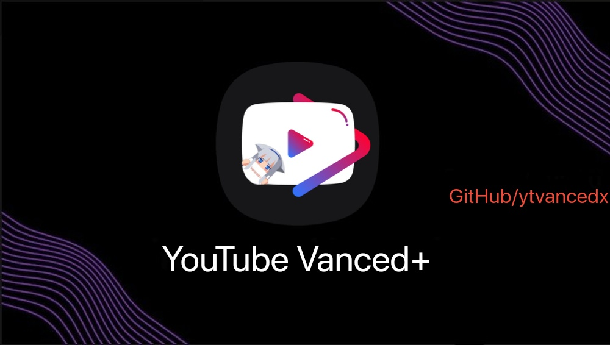

# YouTube Vanced+ [WIP]
**Modification of YouTube/YouTube Music app for Android with ad-free, background playback and many other tweaks, our aim is open source everything we modified for YouTube/YouTube Music !**

## Donate this project (Not required) (GitHub)

    <a href="https://github.com/sponsors/cuynu"></img></a>

  

  

    

## Table of Contents (Quick navigation) 

* [Credits](#credits)
* [Features](#features)
* [Known issues](#known-issues)
* [Building YouTube Vanced+ from source](#building)
* [Download YouTube Vanced+ APKs](#download)
* [Troubleshoot](#troubleshoot)
* [Source code](#source-code)

# Introduction 
This project was created after discontinuation of Vanced official aswell wars between Unofficial Vanced and ReVanced Extended. Its not `YouTube Vanced` and just is the CLONE of `YouTube Vanced`. The project are in development and will going release soon as possible!

# Features 
- **Almost same as Official `YouTube Vanced`**
- **YouTube Vanced+ blocks ads from YouTube and uses SponsorBlock to skip in-video sponsor segments**
- **The picture-in-picture mode allows watching videos in a floating window**
- **Background play allows playing video sound in background**
- **Override max resolution**
- **Swipe control for brightness and volume**
- **Google login like the original YouTube app using Vanced+ MicroG**
- **Dislike counter re-added using the Return YouTube Dislike database**
- **Disable YouTube Shorts function everywhere**
- **Enable old layout of YouTube**
- **Download videos from YouTube using external downloader app**
- **Custom video speed**
- **Enable YouTube Premium header (not actually enable Premium features!)**
- *Many more...*

# Download  

Notice : It is recommended to build Vanced+ yourself instead of using pre-bulit apk, follow **[this instruction](#building)** to build for yourself. if you can't build or lazy, use pre-bulit apk below, its have all patches included :)

-------------------------

### YouTube Vanced+ non-root variant 

**[Download latest version of Vanced+ MicroG](https://gitlab.com/cuynu/VancedxMicroG/-/releases)**

Current Version : **18.46.39** | **[Older version](https://gitlab.com/cuynu/ytvancedx/-/releases)**

Minimum Android version : **9+ (Pie)**

### Black Theme 

**[Download Black theme variant for arm64-v8a](https://example.com)**

**[Download Black theme variant for armeabi-v7a](https://example.com)**

**[Download Black theme variant for x86](https://example.com)**

**[Download Black theme variant for x86_64](https://example.com)**

**[Download Black theme variant for Universal (GitHub)](https://example.com)**

-------------------------

### Dark Theme

**[Download Dark theme variant for arm64-v8a](https://example.com)**

**[Download Dark theme variant for armeabi-v7a](https://example.com)**

**[Download Dark theme variant for x86](https://example.com)**

**[Download Dark theme variant for x86_64](https://example.com)**

**[Download Dark theme variant for Universal (GitHub)](https://example.com)**

-------------------------

### Material You Theme (Android 12+)
 
**[Download Material You theme variant for arm64-v8a](https://example.com)**

**[Download Material You theme variant for armeabi-v7a](https://example.com)**

**[Download Material You theme variant for x86](https://example.com)**

**[Download Material You theme variant for x86_64](https://example.com)**

**[Download Material You theme variant for Universal (GitHub)](https://example.com)**

-------------------------

### YouTube Vanced+ root variant (Magisk/KernelSU) 

Notice : Install **[detach module](https://github.com/j-hc/zygisk-detach/releases)** to prevent Play Store from update and replace installed Vanced+. If you are using microG services core as replacement for GMS, enable `Fix video playback issue` on Vanced+ settings -> Video to fix buffering issue !

Current Version : **18.46.39** | **[Older version](https://gitlab.com/cuynu/ytvancedx/-/releases)**

Minimum Android version : **9+ (Pie)**

### Black Theme

**[Download Black theme variant for Universal](https://example.com)**

-------------------------

### Dark Theme 

**[Download Dark theme variant for Universal](https://example.com)**

-------------------------

### Material You Theme (Android 12+)
 
**[Download Material You theme variant for Universal](https://example.com)**

-------------------------

### YouTube Music Vanced+ non-root variant

**[Download latest version of Vanced+ MicroG](https://gitlab.com/cuynu/VancedxMicroG/-/releases)**

Current Version : **6.28.52** | **[Older version](https://gitlab.com/cuynu/ytvancedx/-/releases)**

Minimum Android version : **9+ (Pie)**

**[Download for arm64-v8a](https://example.com)**

**[Download for armeabi-v7a](https://example.com)**

**[Download for x86](https://example.com)**

**[Download for Universal](https://example.com)**

-------------------------

### YouTube Music Vanced+ root variant

Notice : Install **[detach module](https://github.com/j-hc/zygisk-detach/releases)** to prevent Play Store from update and replace installed Vanced+.

**[Download for arm64-v8a](https://example.com)**

**[Download for armeabi-v7a](https://example.com)**

**[Download for x86](https://example.com)**

-------------------------

## Source code

**Official YouTube app itself are proprietary and closed source, we can't access YouTube source code because its are private which only Google/YouTube developer can see its original code in kotlin and java which is not obfuscated and modify it. So we can only patch and modify YouTube from published compiled binary apk which is extremely obfuscated by Google/YouTube developer when they compiling YouTube app. Here is source code for what was modified and all of Vanced+/Vanced features, again, DONT ask for YouTube app source code! :**

#### [View source code of YouTube Vanced+ (patches)](https://gitlab.com/cuynu/vancedx-patches)

#### [View source code of YouTube Vanced+ (integrations)](https://gitlab.com/cuynu/vancedx-integrations)

#### [View source code of YouTube Vanced+ (cli)](https://gitlab.com/cuynu/vancedx-cli)

-------------------------

## Contribute  

Users can contribute translation or new features to this project, but remember put your contributed features to "Community features" section on `Vanced+ settngs -> Extra` instead of other section and make sure these feature must be **DISABLED** by default ! 

-------------------------

### Known issues 

- Chromecast v2 casting does not works on non-root variant due to Vanced+ microG
- In-app purchases can't be processed on non-root variant

-------------------------

### Troubleshoot 

> If these solution isn't fix your problem, please create issues **[here.](https://gitlab.com/cuynu/ytvancedx/-/issues)**

**Video playback not working (buffer issue)**

Solution for YouTube Vanced+ (18.44.40+) :
- Enable `Fix video playback buffer issue` option on Vanced settings -> Video. Buffering problem should fix.

**No internet connection:**
- Remove your account from Vanced+ MicroG (If have and try again)
- Wipe Vanced+ MicroG & YouTube Vanced+ & YouTube Music Vanced+ app data and cache
- Enable auto start for Vanced+ MicroG if you use heavy customized Android version such as  MIUI,OneUI,FlymeOS,HarmonyOS,etc
- For Tecno user : Find and open Phone Master app, go to auto start manager, allow Vanced+ microG and YouTube Vanced+ auto start.

**App not installed :**
- Free up some storage space and try again
- Uninstall official YouTube Vanced client downloaded from Vanced Manager or other unknown sources then try again.
- Make sure you have downloaded Universal version of YouTube Vanced+/YouTube Music Vanced+
- Check out if old YouTube Vanced still installed in multiple user & virtual space mode

**Crash when opening & "Vanced+ microG can't be started :(" toast showing :**
- Install or reinstall Vanced+ MicroG 
- Turn off battery optimization for Vanced+ MicroG
- Allow Vanced+ MicroG run on background or auto start (on heavy customized OS : MIUI,OneUI,FlymeOS,HarmonyOS,etc)
- For Tecno user : Find and open Phone Master app, go to auto start manager, allow Vanced+ microG and YouTube Vanced+ auto start.
- Wipe app data and cache
- Reinstall YouTube Vanced+ client

**There was a problem parsing the package:**
- Check your Android version, Make sure your current Android version meet minimum required Android version.
- Redownload APK file.

-------------------------

### Building

**Building from Vanced+ source code**

**CAUTION : Only Android & Linux are supported !!!**

**WSL/Mac users will get this warning :** `vancedx-cli are not allowed under this environment, quiting...`

Clone essential repository

`git clone https://gitlab.com/cuynu/vancedx-patches.git` 

`git clone https://gitlab.com/cuynu/vancedx-integrations.git`

`git clone https://gitlab.com/cuynu/vancedx-cli.git`

Open `vancedx-patches` repository in IntelliJ IDEA, make your changes and compile it, output should be `vancedx-patches-vX.XXX.jar`

Open `vancedx-integrations` repository in Android Studio, make your change and compile it, output should be `vancedx-integrations-vX.XXX.apk`

Open `vancedx-cli` repository in IntelliJ IDEA, make your change and compile it, output should be `vancedx-cli-vX.XXX.jar`

**Patching YouTube app**

- For Android users or who lazy to bulit patches & integrations & cli from source, use pre-bulit package here : 

[vancedx-patches pre-bulit](https://gitlab.com/cuynu/vancedx-patches/-/releases) 

[vancedx-integrations pre-bulit](https://gitlab.com/cuynu/vancedx-integrations/-/releases) 

[vancedx-cli pre-bulit](https://gitlab.com/cuynu/vancedx-cli/-/releases)

**Linux :**
- Make sure you have installed `openjdk-17`
- Compile all of essential components or download pre-bulit package above
- Download YouTube or YouTube Music apk (not apks,apkm) and rename it to youtube.apk (YouTube), ytm.apk (for YouTube Music)
- Use Command below to patch.

**Android :**
- Install [Termux](https://termux.dev/en/), open and install openjdk `pkg install openjdk-17` `y` 
- type `curl -sLo vancedx-patches.jar [paste download url]`
- type `curl -sLo vancedx-integrations.apk [paste download url]`
- type `curl -sLo vancedx-cli.jar [paste download url]`
- Download YouTube or YouTube Music apk (not apks,apkm) and rename it to youtube.apk (YouTube), ytm.apk (for YouTube Music)
- Use Command below to patch.

 **Command & example**

**YouTube (Linux) (dont run as sudo !) :**

`java -jar 'vancedx-cli-vX.XXX.jar' -p 'vancedx-patches-vX.XXX.jar' -i 'vancedx-integrations-vX.XXX.apk' -lp 'patch-name' --jks 'yourjkskey.jks' --input 'youtube.apk' --output '/VancedXAPKs/base-vx.apk'`

**YouTube Music (Linux) (dont run as sudo !) :**

`java -jar 'vancedx-cli-vX.XXX.jar' -p 'vancedx-patches-vX.XXX.jar' -i 'vancedx-integrations-vX.XXX.apk' -lp 'patch-name-music' --jks 'yourjkskey.jks' --input 'ytm.apk' --output '/VancedXAPKs/base-vx.apk'`

**YouTube (Termux):**

`java -jar 'vancedx-cli.jar' -p 'vancedx-patches.jar' -i 'vancedx-integrations.apk' -lp 'patch-name' --jks 'yourjkskey.jks' --input '/sdcard/Download/youtube.apk' --output '/VancedXAPKs/base-vx.apk'`

**YouTube Music (Termux):**

`java -jar 'vancedx-cli.jar' -p 'vancedx-patches.jar' -i 'vancedx-integrations.apk' -lp 'patch-name-music' --jks 'yourjkskey.jks' --input '/sdcard/Download/ytm.apk' --output '/VancedXAPKs/base-vx.apk'`

Tips : If you getting `Error: Invalid or corrupt jarfile`, redownload essential components then try again.

After patching process, its will generate base-vx.apk in `/sdcard/VancedXAPKs` (Android) or `/home/username/VancedXAPKs` (Linux)

For non-root users, install Vanced+ microG and patched `base-vx.apk` then enjoy !

For root users, follow additional steps on **[Vanced+ Module Template](https://gitlab.com/cuynu/vancedx-module-template)** !

# Credits

**[Team Vanced](https://github.com/TeamVanced)** : Old YouTube Vanced official which is closed source

**[ApkTool](https://ibotpeaches.github.io/Apktool/)** : Reverse Engineering tool

**[JadX](https://github.com/skylot/jadx)** : Dex (Smali) to Java decompiler (not too helpful as this doesnt actually decompile to right original Java/Kotlin code)

**Android Studio/IntelliJ IDEA : IDE to write and implement YouTube Vanced+**

**[inotia00](https://github.com/inotia00)** : Old YouTube Vanced (RVX) based patches (17.34.36-18.21.34)

**[ReVanced Team](https://github.com/revanced)** : ReVanced Team

-------------------------

## [Go back to top of this page](#youtube-vanced-wip)
